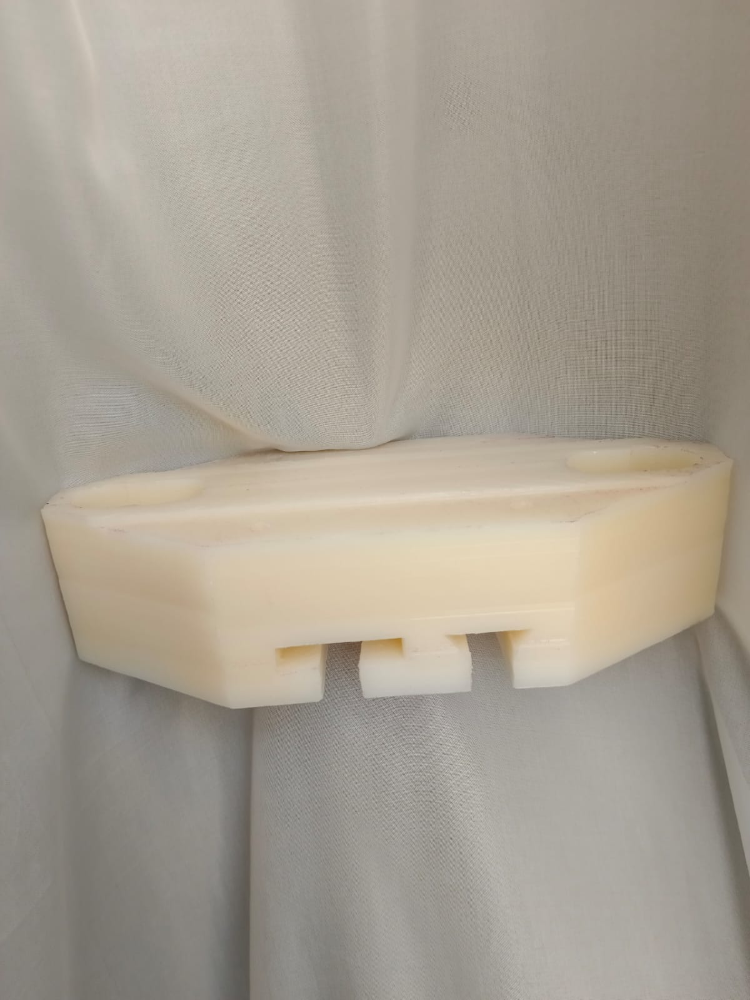
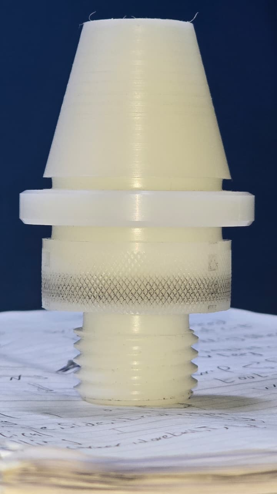
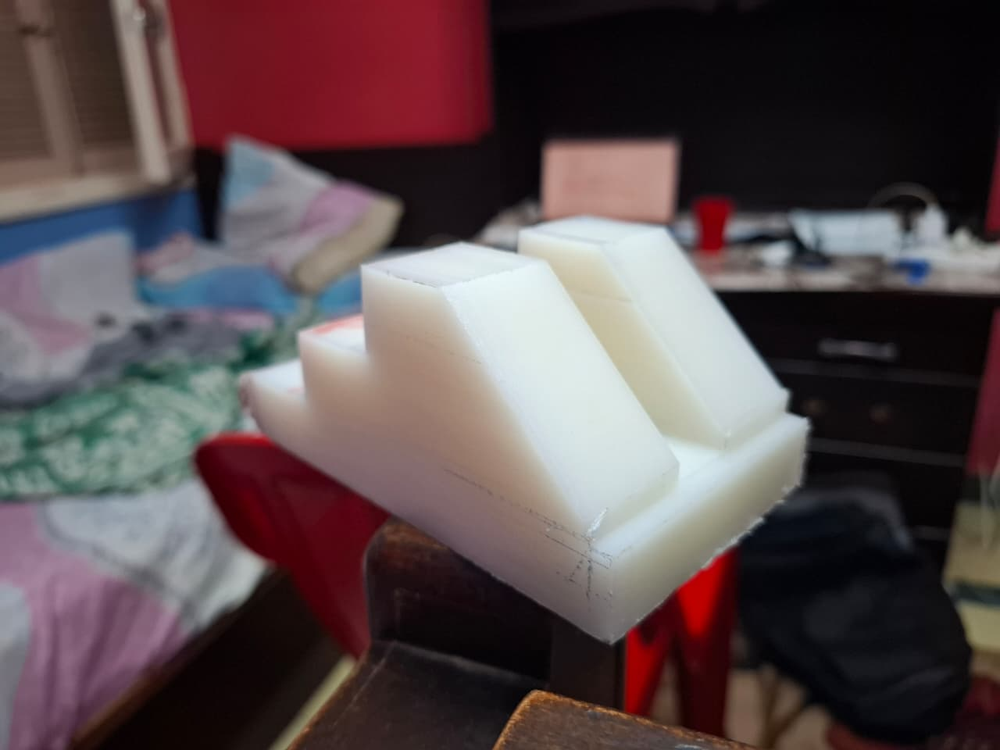

# 🔧 Manufacturing Technology — MDP281S Lab Series

> **Course:** Manufacturing Technology (MDP281S) · Ain Shams University  
> **Program:** Sophomore Mechanical Engineering · Fall 2025  
> **Team:** Team 52 / Section 5 · Supervised by Eng. Basem Tarek  
> **Material:** Polyamide PA6 (Artilon) — Density = 1.4 g/cm³  
> **Cutting Tool Material:** High Speed Steel (HSS) throughout

---

## 📌 Project Overview

A complete manufacturing workflow applied to a **Polyamide PA6 (Artilon)** workpiece across 4 progressive lab sessions, covering the full spectrum of conventional machining operations. Each lab built on the previous one, taking the raw block from initial dimensions down to a precisely machined final product featuring T-slots, dovetail slots, drilled and reamed holes, threaded features, and shaped profiles.

After completing all conventional machining labs, the final parts were **modelled in SolidWorks**, **manufactured on a CNC machine**, and **3D printed using FDM (Elegoo Cura slicer)** for comparison and validation.

---

## 🏭 Manufacturing Process Overview

| Lab | Process | Machine | Key Operations |
|-----|---------|---------|----------------|
| Lab 2 | Milling A + Drilling | Vertical Milling + Drilling Machine | End milling, face milling, centering, drilling, reaming, counterboring, tapping |
| Lab 3 | Milling A (Advanced) | Vertical Milling Machine | End milling, face milling, slot milling, inclined milling, round corner milling, tapping M8×1.25 |
| Lab 4 | Milling B | Vertical Milling Machine | End milling, face milling, T-slot milling, dovetail milling |
| Shaper | Shaping | Shaper Machine | Vertical, horizontal & inclined shaping, drilling, counterboring |

---

## 📂 Full Project Files — Google Drive

All lab reports, working drawings, SolidWorks models, CNC files, and 3D printing files are available here:

> 📁 **[Click here to access the full project folder on Google Drive](https://drive.google.com/drive/folders/1_nh-n4oOhPZYv5zSrfln-0C4mshJdaQD?usp=drive_link)**

---

## ⚙️ Lab Breakdown

### 🔵 Lab 2 — Drilling & Milling (Combined)
**Raw dimensions:** 220×140×35 mm → **Final:** 210×130×30 mm

**Machines used:** Vertical milling machine + Drilling machine

**Operations performed:**
- End milling (length & width reduction) at N = 2600 rpm
- Face milling (thickness reduction 35→30 mm)
- Slot milling (through slot)
- Inclined end milling at 30° using rotary table
- Round corner milling
- Centering & drilling: Ø5.1, Ø7, Ø8.05, Ø10, Ø14 mm holes (through & blind)
- Reaming for precision fits (Ø6, Ø8.058 mm)
- Counterboring Ø22 mm (4 holes, 10 mm deep)
- Tapping M6×1 (2 threaded holes)

**Total machining time:** 10.666 min | **Optimised time:** 4.21 min

---

### 🟢 Lab 3 — Milling A
**Raw dimensions:** 90×210×25 mm → **Final:** 80×200×18 mm

**Machine used:** Vertical milling machine

**Operations performed:**
- End milling length (90→80 mm) at N = 2380 rpm
- End milling width (210→200 mm)
- Face milling thickness (25→20 mm) at N = 995 rpm
- End milling finish pass (20→18 mm)
- Centering & drilling: four Ø6.8 mm through holes (reamed)
- Centering & drilling: two Ø20 mm through holes (stepped: Ø5→Ø10→Ø15→Ø20)
- Through slot milling (20 mm wide)
- Inclined end milling (30° using rotary table)
- Round corner milling (r = 5 mm arc)
- Tapping M8×1.25 (4 threaded holes)

**Total machining time:** 10.666 min | **Optimised time:** 4.21 min

---

### 🟡 Lab 4 — Milling B (T-slot & Dovetail)
**Raw dimensions:** 170×120×75 mm → **Final:** 160×112×70 mm

**Machine used:** Vertical milling machine

**Operations performed:**
- End milling length (170→160 mm) at N = 2020 rpm — 2 roughing + 2 finishing strokes per side
- End milling width (120→112 mm)
- Face milling thickness (75→70 mm) at N = 660 rpm
- T-slot groove milling (Ø26 mm end mill) → T-slot cutting (Ø36 mm T-slot cutter, W=16 mm)
- Dovetail groove milling → Dovetail cutting (Ø50 mm, α=60°)

**Fixation methods:** Machine vise + T-clamps

| Operation | Tool | RPM | Time |
|-----------|------|-----|------|
| End mill (length) | Ø26 mm HSS | 2020 | 3 min |
| End mill (width) | Ø26 mm HSS | 2020 | 4 min |
| Face mill | Ø80 mm HSS | 660 | 4 min |
| T-slot groove | Ø26 mm end mill | 2020 | 0.5 min |
| T-slotting | Ø36×16 mm T-slot cutter | 1460 | 0.36 min |
| Dovetail groove | Ø26 mm end mill | 2020 | 1.1 min |
| Dovetail milling | Ø50 mm, 60° dovetail cutter | 1050 | 0.71 min |

---

### 🔴 Shaper Lab — Shaping Operations
**Raw dimensions:** 140×90×65 mm → **Final:** Stepped/profiled part with drilled holes

**Machine used:** Shaper machine (single-point cutting tool)

**Operations performed:**
- Vertical shaping: length reduction (140→130 mm), width (90→80 mm)
- Horizontal shaping: thickness reduction in stages (65→60→40→20 mm)
- Inclined shaping: 45° profile (6 incremental steps, N = 578 strokes)
- Vertical shaping: pocket features
- Centering & drilling: Ø8 mm holes
- Counterboring: Ø15 mm (2 holes, 6 mm deep)

**Key parameter:** V = 122 strokes/min, S = 0.635 mm/stroke

**Total machining time:** 27.186 min (cutting) | 51.24 min (including return strokes)

---

## 🖥️ CNC Machining

After completing conventional machining, the parts were reproduced on a **CNC vertical milling machine**:
- G-code generated from SolidWorks CAM
- Achieved tighter tolerances than manual machining
- Demonstrated the speed advantage of CNC over conventional methods

> 📁 Add your CNC G-code files and SolidWorks CAM screenshots to the `cnc/` folder

---

## 🖨️ 3D Printing (FDM)

The final part geometry was also fabricated via **FDM 3D printing**:
- CAD model exported from SolidWorks as `.STL`
- Sliced using **Elegoo Cura** slicer
- Printed in PLA for geometry verification and visual comparison with machined parts
- Demonstrated the difference in surface finish, tolerances, and production time between additive and subtractive manufacturing

> 📁 Add your `.stl` files and Cura screenshots to the `3d-printing/` folder

---

## 📁 Repository Structure

```
manufacturing-technology-MDP281/
├── lab2-drilling-milling/
│   ├── lab2-report.pdf
│   ├── working-drawing.pdf
│   └── images/
├── lab3-milling-a/
│   ├── lab3-report.pdf
│   ├── working-drawing.pdf
│   └── images/
├── lab4-milling-b/
│   ├── lab4-report.pdf
│   ├── working-drawing.pdf
│   └── images/
├── shaper-lab/
│   ├── shaper-report.pdf
│   └── images/
├── cnc/
│   ├── gcode/
│   └── screenshots/
├── 3d-printing/
│   ├── model.stl
│   └── cura-screenshots/
├── solidworks/
│   ├── part.SLDPRT
│   ├── assembly.SLDASM
│   └── drawings/
└── README.md
```

---

## 📸 Project Gallery

> Add your lab photos below — replace the filenames with your actual image names







---

## 🛠️ Tools & Equipment Summary

| Tool | Specs | Used In |
|------|-------|---------|
| End mill cutter | Ø20–26 mm, HSS | Labs 2, 3, 4 |
| Face mill cutter | Ø80 mm, H=13 mm | Labs 2, 3, 4 |
| T-slot cutter | Ø36 mm, W=16 mm | Lab 4 |
| Dovetail cutter | Ø50 mm, α=60° | Lab 4 |
| Twist drills | Ø5–20 mm | Labs 2, 3, Shaper |
| Reamer | Ø6, Ø8.058 mm | Labs 2, 3 |
| Tap | M6×1, M8×1.25 | Labs 2, 3 |
| Single-point tool | HSS | Shaper |
| Counterbore | Ø15, Ø22 mm | Labs 2, Shaper |

---

## 👥 Team

| # | Name | ID |
|---|------|----|
| 1 | Ahmed Ali Ahmed | 2400322 |
| 2 | Ahmed Sayed Sobhi | 2301284 |
| 3 | Ahmed Tamer Mahmoud | 2401709 |
| 4 | Ali Mohamed Ahmed Hassan | 2400469 |
| 5 | Amr Waleed Bakr | 2400588 |
| 6 | Basel Ibrahim Ahmed | 2400338 |
| 7 | Mahmoud Samy Abdelgafar | 2400670 |
| 8 | Mohamed Abdallah Abdelkader | 2400866 |
| 9 | Omar Mamdouh Mohamed | 2400990 |
| 10 | Safey Eldeen Samy Zidan | 2400396 |

---

*Ain Shams University · Faculty of Engineering · Manufacturing Technology MDP281S · Fall 2025*
